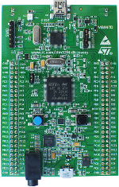
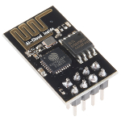
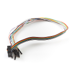
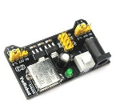

# WiFi power outlet

**EN:** This is english version of readme doc. If you prefer, you may switch to polish version contained in [readme.PL.md][ext0].  
**PL:** To jest angielska wersja pliku readme. Aby przejść do polskiej wersji otwórz plik [readme.PL.md][ext0].

## Warnings
1) Be careful when coping with high voltages! Risk of electric shock!
2) Project does not provide connection authorization, everyone can connect to opened WiFi network, sniff packets and send controlling data. Home usage is not recommended.

## Overview
Make your life convenient. Use application to turn on and off power outlets via WiFi. Can be used with desk lamps, aquarium pumps, heaters, fans and many other.

## Description
Project contains C# application that can be used to control two power outlets via WiFi. System is based on STM32 microcontroller and ESP8266-01 WiFi board communicating with AT commands via UART.

## Tools
### Necessary elements
STM32F407G-DISC1  
  
ESP8266-01  
  
2 relay module or 2 modules of one relay each  
  
Cables  

### Recommended optional elements
ESP8266-01 to breadboard bridge (prevents loosen cables from causing resets; [more photos][ext12])  
  
External power supply (3.3V, 0.5A or higher)  
  
Breadboard  
  
FT232 or other USART<->USB converter for debug  

## How to run
### Connections

| ESP8266 |  STM32  | FT232 (debug) |
|---------|---------|-------|
|   GND   |   GND   |  GND  |
|   Rx    | PC10 Tx |  Tx/Rx   | 
|   Tx    | PC11 Rx |  Rx/Tx   |
|   VCC   |  VCC 3V | - |
|  CH_PD  |  VCC 3V | - |

               +----------------+
               | +-+ +-+ +-+ +- |
               | | | | | | | |  |
               | | +-+ +-+ +-+  |
               | +------------- |
               | |  ESP8266-01  |
             .-|-----.    .-----|-.
     GPIO2 o-  |GND GPI2 GPI0 RX|  -o GPIO0
     GND   o---|--O   O   O   O-|---o Rx
     Tx    o---|--O   O   O   O-|---o VCC
     CH_PD o-  |TX CH_PD RST VCC| .-o RST
             \ +----------------+ |
              `-------'    `------'

External power source for ESP8266 is highly recommended.  
Tx/Rx and Rx/Tx in FT232 column are dependent from which way communication you want to debug.  
Disconnect FT232's Tx when ESP8266's Rx is connected to STM32.

|  Relay modules  | STM32 |
|---------|---------|
|   VCC   |  VCC 5V |
|   GND   |   GND   |
|   IN1   |   PE12  |
|   IN2   |   PE13  |

### Compilation
STM32 code: Compile main.c with CooCox IDE. Used libraries can be found in main.c file at the begining. You may use provided *.coproj file which has all settings and repositories configured.  
Windows app: Compile with Visual Studio, version 4.5.2 of .NET Framework is necessary.

### Usage
1) Connect to AI-Thinker network (open);
2) Run compiled Windows app;
3) Give ESP's IP and port (default 192.168.4.1:80) and click "Connect";
4) Go to "Sockets" and use "SOCKET1" and "SOCKET2" buttons to switch relays' states.

## Future improvements
- Support for 1-Wire DS18B20 thermometer;
- On-time switching based on RTC;
- Authorization and traffic encryption.

## Attributions
Some configs are copied from Google Docs files from laboratory classes. Codes pulled from other repositories are marked with comments inside files.  
### Special thanks to:
* [Arek Kolodynski][ext10] (delay function, project configuration)
* [Piotr Grabuszynski][ext11] (ESP8266 connections, soldering and sending ESP8266 bridge)

### Readme images
STM32F4 (picture and scheme): producer's documentation (Feb 2016)  
ESP8266-01: [sparkfun.com][ext1]; CC BY 2.0  
relays: [amazon.com][ext2]  
cables: [sparkfun.com][ext3]; CC BY 2.0  
power supply: [play-zone.ch][ext4]  
breadboard: [allelectronic.com][ext5]  
FT232: [botland.com.pl][ext6]  

## Code license
Whole code is licenced under MIT licence, available in [LICENSE][ext7] file.

## Credits
**[Dawid Korach][ext8]**  
dawid.korach[at]student.put.poznan.pl  
  
**[Mateusz Grabuszyski][ext9]**  
mateusz.grabuszynski[at]student.put.poznan.pl

The project was conducted during the Microprocessor Lab course held by the Institute of Control and Information Engineering, Poznan University of Technology.  
Supervisor: Marek Kraft

Last change: 2017-08-02

<!--LINKS-->
[ext0]: readme.PL.md
[ext1]: sparkfun.com/products/13678
[ext2]: https://www.amazon.co.uk/2-Channel-Module-Shield-Arduino-Electronic-x/dp/B00CRVYIMG
[ext3]: sparkfun.co/products/9556
[ext4]: http://www.play-zone.ch/en/ywrobot-3-3v-5v-power-adapter-fur-breadboards-mit-gruner-led.html
[ext5]: http://www.allelectronics.com/item/pb-400/solderless-breadboard-400-contacts/1.html
[ext6]: https://botland.com.pl/konwertery-usb-uart-rs232-rs485/4502-konwerter-usb-uart-ft232.html
[ext7]: LICENSE
[ext8]: https://github.com/E34tf
[ext9]: https://github.com/MateuszGrabuszynski
[ext10]: https://github.com/ArkadiuszKolodynski
[ext11]: https://github.com/piograbu
[ext12]: readme-images/esp-bridge-more.jpg