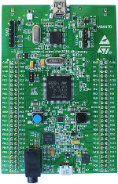
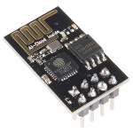
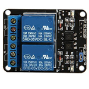
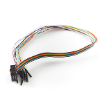
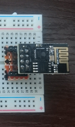
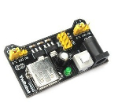
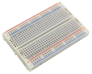
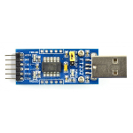
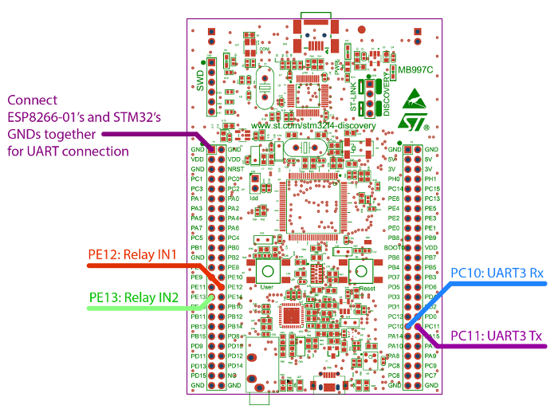

# WiFi power outlet

**PL:** To jest polska wersja pliku readme. Aby przejść do angielskiej wersji otwórz plik [readme.md][ext0].  
**EN:** This is polish version of readme doc. If you prefer, you may switch to english version contained in [readme.md][ext0].  

## Ostrzeżenie
Uważaj podczas pracy z wysokim napięciem!

## Przegląd
Uprość sobie życie. Użyj aplikacji by włączać i wyłączać gniazdka łącząc się z nimi po WiFi. Można jej używać do lampek, pomp akwariowych, grzejników elektrycznych, wiatraków i wielu innych.

## Opis
Projekt zawiera aplikację w języku C#, która może być użyta do sterowania dwoma gniazdkami elektrycznymi po WiFi. System opiera się na mikrokontrolerze STM32 oraz płytce ESP8266-01, które komunikują się przy użyciu komend AT przesyłanych przez UART.

## Narzędzia
### Potrzebne elementy
STM32F407G-DISC1  
  
ESP8266-01  
  
Moduł z dwoma przekaźnikami bądź dwa moduły z jednym przekaźnikiem w każdym  
  
Kable  

### Zalecane opcjonalne elementy
Mostek pomiędzy ESP8266-01 a płytką prototypową (zapobiega resetom powodowanym przez luźno wpięte kable; [zdjęcia][ext12])  
  
Zewnętrzny zasilacz (3.3V, min. 0.5A)  
  
Płytka prototypowa  
  
FT232 lub inny konwerter USART<->USB dla testów  

## Jak uruchomić

| ESP8266 |  STM32  | FT232 (testy) |
|---------|---------|-------|
|   GND   |   GND   |  GND  |
|   Rx    | PC10 Tx |  Tx/Rx   | 
|   Tx    | PC11 Rx |  Rx/Tx   |
|   VCC   |  VCC 3V | - |
|  CH_PD  |  VCC 3V | - |

Zaleca się użycie zewnętrznego źródła zasilania dla ESP8266.  
Tx/Rx i Rx/Tx w kolumnie FT232 oznaczają zależność od testowanego kierunku komunikacji.  
Należy odłączyć pin Tx od FT232 gdy ESP8266 jest podłączony do STM32.

|  Moduł przekaźników  | STM32 |
|---------|---------|
|   VCC   |  VCC 5V |
|   GND   |   GND   |
|   IN1   |   PE12  |
|   IN2   |   PE13  |

## Jak skompilować
Kod dla STM32: Skompiluj program main.c przy użyciu środowiska CooCox IDE. Dla wygody, możesz użyć dostarczonego pliku w formacie *.coproj, w którym ustawiono już wszystkie repozytoria.  
Aplikacja Windows: Skompiluj przy użyciu Visual Studio.

## Przyszłe usprawnienia
- Dodanie wsparcia dla termometru DS18B20;
- Przełączanie zależne od czasu oparte na zegarze czasu rzeczywistego.

## Przypisy
Niektóre elementy konfiguracji zostały przekopiowane z plików zawartych na Google Docs, które dostarczono podczas zajęć laboratoryjnych. Kod przepisany z innych repozytoriów zaznaczono komentarzami w plikach.
### Podziękowania dla:
* [Arek Kolodynski][ext10] (funkcja opóźniająca, konfiguracja projektu)
* [Piotr Grabuszynski][ext11] (podłączenie ESP8266, zlutowanie i przesłanie mostka dla ESP8266)

### Obrazy zawarte w tym pliku
STM32F4 (obrazek i schemat): dokumentacja producenta (luty 2016)  
ESP8266-01: [sparkfun.com][ext1]; CC BY 2.0  
przekaźniki: [amazon.com][ext2]  
kable: [sparkfun.com][ext3]; CC BY 2.0  
zasilacz: [play-zone.ch][ext4]  
płytka prototypowa: [allelectronic.com][ext5]  
FT232: [botland.com.pl][ext6]  

## Licencja
Cały kod udostępniono na licencji MIT, dostępnej w oryginale w pliku [LICENSE][ext7].

## Autorzy
**[Dawid Korach][ext8]**  
dawid.korach[at]student.put.poznan.pl  
  
**[Mateusz Grabuszyski][ext9]**  
mateusz.grabuszynski[at]student.put.poznan.pl

Projekt wykonano podczas zajęć laboratoryjnych Podstaw technik mikroprocesorowych prowadzonych przez Instytut Automatyki i Inżynierii Informatycznej Politechniki Poznańskiej pod nadzorem dra Marka Krafta.

<!--LINKS-->
[ext0]: readme.PL.md
[ext1]: sparkfun.com/products/13678
[ext2]: https://www.amazon.co.uk/2-Channel-Module-Shield-Arduino-Electronic-x/dp/B00CRVYIMG
[ext3]: sparkfun.co/products/9556
[ext4]: http://www.play-zone.ch/en/ywrobot-3-3v-5v-power-adapter-fur-breadboards-mit-gruner-led.html
[ext5]: http://www.allelectronics.com/item/pb-400/solderless-breadboard-400-contacts/1.html
[ext6]: https://botland.com.pl/konwertery-usb-uart-rs232-rs485/4502-konwerter-usb-uart-ft232.html
[ext7]: LICENSE
[ext8]: https://github.com/E34tf
[ext9]: https://github.com/MateuszGrabuszynski
[ext10]: https://github.com/ArkadiuszKolodynski
[ext11]: https://github.com/piograbu
[ext12]: readme-images/esp-bridge-more.jpg